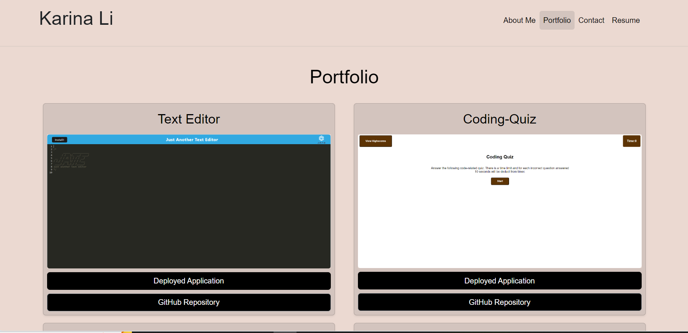

# My-Portfolio-React

## Description

This application is my portfolio using react. I created this portfolio to showcase my recent projects and skills. 

## Table of Contents

- [Deployment](#deployment)
- [Sample Application](#sample-application)
- [Reference](#reference)
- [License](#license)
- [Contact](#contact)

## Deployment

The React Portfolio is deployed on Netlify. You can access the application [here](https://superlative-stardust-1451f9.netlify.app).

## Sample Application

## Reference

- [React](https://reactjs.org/)
- [React-Bootstrap](https://react-bootstrap.github.io/)
- [React-Icons](https://react-icons.github.io/react-icons/)

## License

MIT license was used for this application.

## Contact

For any questions, please contact me at <karina.yukting.li@gmail.com>.
GitHub Profile: https://github.com/karina-yuk
